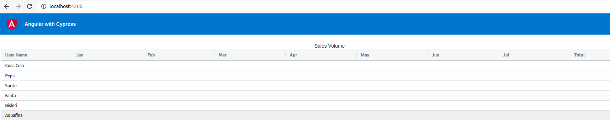

# Angular with Cypress

This is a basic Angular project with ag-grid. Main purose is to demonstrate UI test automation using Cypress.

## Setup

Run `npm install` to install necessary dependeices.

## Run

Run `ng serve` to start the application.

## View UI

Open browswer and navigate to `http://localhost:4200/` to view the application.

You should be able to see the UI as follows:

## Start Cypress

Run `npm run cypress:open` to bring up Cypress Test Runner UI

## Running Cypress Automation tests

From the Cypress Test Runner UI, select respective test specs to run the test

